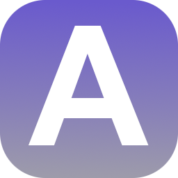

  

<h1 align="center">Flask Animals</h1>

A simple CRUD REST API developed in Flask, Bootstrap 5 and Postgres, based on animals to mislead the fact that it is still just a CRUD REST API.

## Context

> NOTE: This is a public update of the project and I want to be brief as I have already written more details about this project in the demo, more information below.

This is my first project developed in Flask and second overall in Python. The goal of this one was just to give a very quick test of this little framework that caught my attention at the time, so it's probably the simplest thing I've done so far.

The code has received virtually no modification beyond this README, a license, and little else. There really is not much more to add since it is a small learning project with nothing very interesting. This one was going to be even simpler (completely RESTfull) but I decided to add a bit more just to make it more "presentable".

You can check, if you are interested, the About page of the demo I wrote back then, where you will find more details.

Thanks for reading! ❤️

_\- DevCorvus_
